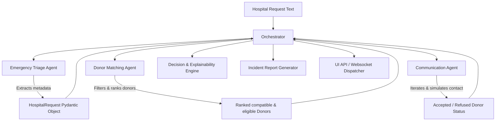

# BloodFlow AI — Application Summary

BloodFlow AI is a multi-agent emergency blood donation coordination platform designed to automate and orchestrate the process of receiving hospital blood requests, triaging urgency, matching compatible and eligible donors, coordinating communication, and providing complete decision explainability.

---

## 🛠️ Technology Stack

The application is split into a Python-based backend service layer and a React-based frontend application:

### 1. Backend Stack
*   **Core Language**: Python 3.10+
*   **Frameworks & Libraries**:
    *   **FastAPI**: Lightweight, high-performance REST API backend.
    *   **Uvicorn**: ASGI web server running FastAPI.
    *   **Pydantic (v2)**: Data validation and settings management using schemas.
    *   **Google ADK (Agent Development Kit)**: Infrastructure for multi-agent coordination.
    *   **MCP (Model Context Protocol)**: For tool-calling standardizations.
*   **AI / LLM Integration**:
    *   **Google GenAI SDK**: Powers the optional LLM-driven orchestrator (`GeminiOrchestrator`).
    *   **Ollama Client**: Runs local LLMs and embedding generators for RAG pipelines without requiring cloud API keys.
        *   `llama3.2`: Chat/generation model for RAG.
        *   `nomic-embed-text`: Embedding model for vector indexing.

### 2. Frontend Stack
*   **Framework**: React 18
*   **Build Tool**: Vite
*   **Routing**: React Router DOM (v6)
*   **HTTP Client**: Axios (for calling the FastAPI backend endpoints)
*   **Styling**: Tailwind CSS & custom CSS modules.

### 3. Data & Storage
*   **Database (CSV)**: Local CSV file loaded as the active registry of registered blood donors.
*   **State & Memory Management**:
    *   `InMemoryStore`: Thread-safe dictionary-based memory caching for donor interaction history, tracking status updates, and checking notification cooldowns.

---

## ⚙️ Core Architecture & Internal Mechanisms

The application employs an event-driven orchestrator model to guide data through a sequence of specialized agents and components.



### 1. The Multi-Agent Pipeline

#### Phase A: Triage (Emergency Triage Agent)
*   **Input**: Raw unstructured text from hospitals (e.g. *"Need 2 units of O- blood at Square Hospital ASAP!"*).
*   **Mechanism**: Uses regex pattern-matching rules and lookup tables for known hospitals, blood groups, units, urgency keywords (e.g., *urgent*, *ASAP*, *immediate*), and deadlines. If pattern matching fails or is optional, it can leverage an LLM fallback.
*   **Output**: A structured `HospitalRequest` schema.

#### Phase B: Donor Matching (Donor Matching Agent)
*   **Blood Compatibility**: Uses medical rules (via the `CompatibilityChecker`) to filter donors. E.g., `O-` can donate to any group, while `AB+` can receive from any group.
*   **Eligibility Rules**: Checks health parameters (via the `EligibilityChecker`) such as age boundaries (18–65) and recent donation cooldown times (typically 90 days for males and 120 days for females).
*   **Weighted Multi-Factor Scoring**: Ranks matching donors based on:
    1.  **Response Rate** (40% weight): Historical likelihood of replying.
    2.  **Availability Status** (30% weight): Prefer active/available donors.
    3.  **Proximity / Proximity Distance** (20% weight): GPS distance to the requesting hospital.
    4.  **Recency** (10% weight): Days passed since their last donation (preferring those who donated longer ago).

#### Phase C: Outreach (Communication Agent & Memory)
*   **Outreach Strategy**: Contacts ranked donors sequentially (best first).
*   **Memory Cooldown Checks**: Queries `MemoryStore` before contacting a donor. If a donor was contacted recently (e.g., within 1 hour) or has already accepted/declined, they are skipped to prevent spam.
*   **Simulation**: Simulates message outreach and records if they accepted, declined, or did not respond.
*   **Exit Condition**: Terminates immediately once a donor accepts or when the compatible candidate pool is exhausted.

---

### 2. Decision Explainability Engine
*   **Mechanism**: Once a donor accepts, the `DecisionEngine` evaluates the choice.
*   **Score Breakdown**: Calculates a breakdown of the selected donor's scoring components (compatibility, response rate, proximity, recency).
*   **Natural Language Reasoning**: Generates easy-to-read, natural language justifications (e.g., *"Donor was selected because they represent an exact blood type match, live 1.4km away from Evercare Hospital, and have a 95% response rate."*).

---

### 3. RAG Pipeline (WHO Guidelines)
*   **Data Source**: The local [who_guidelines.txt](file:///c:/Users/Sowmik/Documents/GitHub/bengali-hallucination/BloodFlow_AI/bloodflow_ai/data/who_guidelines.txt) containing medical policies on donor selection.
*   **Embedding & Search**: Chunked by `chunker.py` and embedded locally via Ollama's `nomic-embed-text`. Relevant chunks are retrieved using dot-product similarity comparison.
*   **Generation**: Passes retrieved chunks and the question to Ollama's `llama3.2` or Gemini to answer compliance queries (e.g., *"Can I donate after taking antibiotics?"*) without hallucinations.

---

### 4. Telemetry, Reporting & Dashboards
*   **Event Bus**: Emits structured events (e.g. `WorkflowStarted`, `TriageCompleted`, `MatchingCompleted`, `WorkflowCompleted`) throughout the execution.
*   **Incident Reports**: Automatically generates a formatted Markdown log (`reports/incident_[workflow_id].md`) containing timeline tables, metrics, and score explanations for audit logs.
*   **Dashboard States**: Creates WebSocket event feeds and state models for the React frontend, allowing real-time pipeline monitoring.

---

## 📂 Project Directory Structure

```text
bloodflow_ai/
├── agents/                  # Multi-agent implementations
│   ├── emergency_triage/    # Pattern matching & text extraction
│   ├── donor_matching/      # Compatibility filtering and ranking
│   ├── communication/       # Sequence messaging and memory cooldowns
│   ├── orchestrator/        # Central event-driven pipeline coordinator
│   └── gemini_orchestrator/ # LLM-based reasoning wrapper
├── config/                  # Logging and constant configurations
├── data/                    # Registered donor CSV database & WHO guidelines
├── explainability/          # Scoring explanation and reasoning generators
├── memory/                  # Session tracking and cooldown store
├── rag/                     # Guideline indexing, retriever, and Ollama integration
├── reports/                 # Markdown audit report generators
├── schemas/                 # Pydantic data schemas
├── telemetry/               # central EventBus, MetricsEngine, and Logger
├── tests/                   # Pytest suites and integration demos
├── tools/                   # Compatibility matrices and distance utilities
├── ui_api/                  # State models and WebSocket event maps for the frontend
└── api_server.py            # FastAPI main endpoints
```
